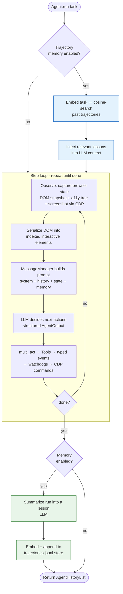

# web-agent

AI-powered browser automation using LLMs and Chrome DevTools Protocol (CDP).

## Features

- **Multi-LLM Support** — Groq (default), OpenAI, Anthropic, Google Gemini, Ollama, Azure, AWS Bedrock, and more
- **Chrome DevTools Protocol** — Direct browser control via CDP through the [cdp-use](https://pypi.org/project/cdp-use/) package
- **Event-Driven Architecture** — Modular watchdog system for downloads, popups, security, and DOM handling
- **Trajectory Memory** — the agent learns from its own past runs: it records a condensed "lesson" after each task and retrieves relevant ones to prime similar future tasks (retrieval-augmented, [see below](#trajectory-memory-learning-from-past-runs))
- **MCP Integration** — Run as an MCP server for Claude Desktop or connect to external MCP servers
- **Code Agent** — Jupyter-like code execution capabilities for data analysis tasks
- **DOM Serialization** — Intelligent DOM extraction with accessibility tree generation and element highlighting

## How It Works

The agent runs a tight **observe → decide → act** loop, optionally augmented with retrieval over its own past experience:



The blue nodes are memory **retrieval** (read side, before step 0); the green nodes are memory **recording** (write side, after the run). Both are opt-in and skipped entirely when memory is disabled — the core loop is unchanged.

## Quick Start

### Prerequisites

- Python >= 3.11
- Chrome or Chromium browser
- An LLM API key (Groq, OpenAI, Anthropic, Google Gemini, etc.)

### Installation

```bash
# Using uv (recommended)
uv venv --python 3.12
source .venv/bin/activate
uv sync

# Or with pip
pip install web-agent
```

### Environment Setup

Copy the example environment file and add your API key:

```bash
cp .env.example .env
```

Edit `.env` and set your LLM provider key. `Agent(llm=None)` auto-resolves a provider from
whichever key is present, in priority order Groq → OpenAI → Anthropic → Google:

```env
GROQ_API_KEY=your_groq_api_key_here
# or
OPENAI_API_KEY=your_openai_api_key_here
# or
ANTHROPIC_API_KEY=your_anthropic_api_key_here
# or
GOOGLE_API_KEY=your_google_api_key_here
```

If Chrome isn't in your PATH, pass the executable path directly (this is a constructor
argument, not an env var):

```python
browser = Browser(executable_path='/path/to/chrome')
```

### Basic Usage

```python
import asyncio
from web_agent import Agent
from web_agent.llm.google import ChatGoogle

async def main():
    llm = ChatGoogle(model="gemini-2.0-flash")
    agent = Agent(
        task="Search Google for 'browser automation' and tell me the top 3 results",
        llm=llm,
    )
    result = await agent.run()
    print(result.final_result())

asyncio.run(main())
```

### Form Filling Example

```python
import asyncio
from web_agent import Agent
from web_agent.llm.google import ChatGoogle

async def main():
    llm = ChatGoogle(model="gemini-2.0-flash")
    agent = Agent(
        task=(
            "Go to https://httpbin.org/forms/post and fill out the form with: "
            "Customer name: John Doe, Telephone: 555-1234, "
            "Email: john@example.com, Size: Medium, "
            "Topping: Cheese. Then submit the form."
        ),
        llm=llm,
    )
    await agent.run()

asyncio.run(main())
```

## CLI

The library includes multiple CLI entry points:

```bash
# Primary CLI commands (all aliases for the same tool)
web-agent <command>
webagent <command>
bu <command>

# Run as MCP server (for Claude Desktop integration)
web-agent --mcp
```

## Architecture

```
web_agent/
├── agent/           # Core agent orchestrator (task loop, LLM interaction)
├── browser/         # Browser session lifecycle, CDP, watchdog services
│   └── watchdogs/   # Downloads, popups, security, DOM, screenshots, and more
├── dom/             # DOM extraction, serialization, accessibility tree
├── llm/             # Multi-provider LLM abstraction layer
│   ├── groq/        # Groq (default provider)
│   ├── openai/      # GPT-4.1, etc.
│   ├── anthropic/   # Claude
│   ├── google/      # Gemini
│   ├── ollama/      # Local models
│   └── ...          # Azure, AWS, Mistral, DeepSeek, etc.
├── tools/           # Action registry (click, type, scroll, navigate)
├── mcp/             # Model Context Protocol server/client
├── code_use/        # Jupyter-like code execution agent
└── tokens/          # Token cost tracking
```

### Key Components

| Component | Description |
|-----------|-------------|
| **Agent** | Main orchestrator — takes tasks, manages browser sessions, runs LLM action loop |
| **BrowserSession** | Manages browser lifecycle, CDP connections, coordinates watchdog services via event bus |
| **Tools** | Action registry mapping LLM decisions to browser operations |
| **DomService** | Extracts and processes DOM content, handles element highlighting and a11y tree |
| **LLM Layer** | Unified abstraction across OpenAI, Anthropic, Google, Groq, Ollama, and more |

### Event-Driven Browser Management

BrowserSession uses a [bubus](https://pypi.org/project/bubus/) event bus to coordinate 12 watchdog services (`web_agent/browser/watchdogs/`), including:

- **DownloadsWatchdog** — File download handling
- **PopupsWatchdog** — JavaScript dialog management
- **SecurityWatchdog** — Domain restrictions and security policies
- **DOMWatchdog** — DOM snapshots, screenshots, element highlighting
- **DefaultActionWatchdog** — Executes click/type/scroll/navigate CDP commands

## Development

### Testing

```bash
# Run CI test suite
uv run pytest -vxs tests/ci

# Run specific test file
uv run pytest -vxs tests/ci/test_specific.py

# Run all tests (including integration)
uv run pytest -vxs tests/
```

### Code Quality

```bash
# Type checking
uv run pyright

# Linting and auto-fix
uv run ruff check --fix

# Formatting
uv run ruff format

# Pre-commit hooks
uv run pre-commit run --all-files
```

## Supported Models

`Agent(llm=None)` auto-resolves a provider from whichever key is set, priority order: Groq → OpenAI → Anthropic → Google.

| Provider | Models | Env Variable |
|----------|--------|-------------|
| Groq (default) | `openai/gpt-oss-20b`, `llama-3.1-8b-instant`, and more | `GROQ_API_KEY` |
| OpenAI | GPT-4.1, GPT-4o, o-series | `OPENAI_API_KEY` |
| Anthropic | Claude Sonnet/Opus/Haiku | `ANTHROPIC_API_KEY` |
| Google | Gemini 2.0/2.5 Flash, Pro | `GOOGLE_API_KEY` |
| Azure | Azure OpenAI models | `AZURE_OPENAI_KEY` |
| AWS | Bedrock models | `AWS_ACCESS_KEY_ID` |
| Ollama | Any local model | (local) |
| DeepSeek, Mistral, Cerebras, OpenRouter, Vercel, OCI | — | see `web_agent/llm/` |

## Trajectory Memory (learning from past runs)

The agent can learn from its own past runs: after each `Agent.run()`, it condenses what
happened into a short "lesson" and stores it; on future similar tasks, relevant past lessons
are retrieved and injected as hints. Adapted from Agent S's narrative-memory approach
([simular-ai/Agent-S](https://github.com/simular-ai/Agent-S)) — embed → cosine-similarity
rank → inject, using an embedding provider of your choice (no vector database).

```python
agent = Agent(task="...", llm=llm, enable_memory=True)
```

or globally via env:

```env
WEB_AGENT_MEMORY_ENABLED=true
```

**Storage** works with any LLM provider (the run is summarized by your agent's own model).
**Retrieval** additionally needs an embedding provider — pick one of:

| Provider | How | Notes |
|----------|-----|-------|
| OpenAI | set `OPENAI_API_KEY` | auto-detected; `text-embedding-3-small` default |
| Google | set `GOOGLE_API_KEY` | auto-detected; `text-embedding-004` default |
| **Ollama** (local, no key) | `WEB_AGENT_EMBEDDING_PROVIDER=ollama` | needs `ollama serve` + `ollama pull nomic-embed-text` |

Groq and Anthropic have **no embeddings endpoint**, so with only a Groq key memory degrades
**gracefully to storage-only** (it records lessons but can't retrieve them) rather than failing —
use Ollama for fully local, keyless retrieval. Requires `pip install web-agent[memory]`.
See [.env.example](.env.example) for all `WEB_AGENT_MEMORY_*` / `WEB_AGENT_EMBEDDING_*` options.

Trajectories are stored as append-only JSONL at `~/.config/webagent/memory/trajectories.jsonl`
(override with `WEB_AGENT_MEMORY_DIR`).

## Roadmap

- **Knowledge-augmented context** — the agent is now prompted to search proactively for
  unfamiliar facts (prices, current events, specs) rather than only as error recovery; a
  richer pre-task research step remains a possible future enhancement
- **Vision Pipeline Optimization** — enhanced screenshot and visual element processing

## Configuration

See [.env.example](.env.example) for all available configuration options: logging, LLM
provider keys, proxy settings, and telemetry. Env vars use upper-snake `WEB_AGENT_*` naming
(legacy mixed-case `web_agent_*` names still work as a fallback). Browser-level settings like
`executable_path`, `headless`, and `user_data_dir` are Python constructor arguments to
`Browser(...)`, not environment variables.

## License

MIT License — see [LICENSE](LICENSE) for details.
